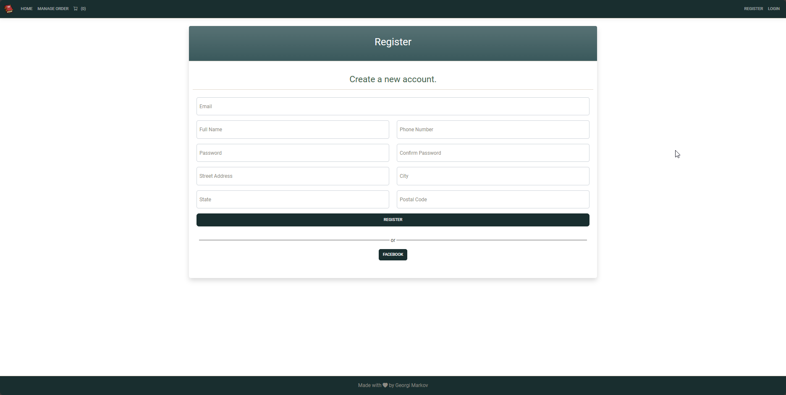
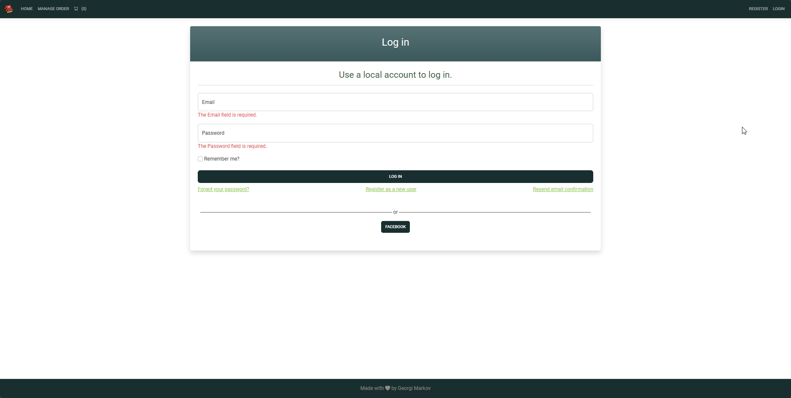

Bulky-ASP.NET-Project-003

# BulkyBook

## Introduction
BulkyBook is application for buying eBooks.

## Features
- Stripe Payment
- DataTables
- SweetAlerts
- Tiny
- Roles

### User Roles
- **Customer**: Upon registration, can shop and pay eBooks
- **Company**: A customer role change to Company by the admin 
- **Admin**: 1st admin is seeded after than admin can change users role to make admins

## Role Details:

### Customer Role
- Can view eBooks and their details
- Can see its own orders
- Add books to cart
- Pay with Stripe Payment

### Company Role
- Company also has the Customer functionality,but i can pay up to 30 days later.

### Admin Role
- Can access Content Management:  
- Create new users
- Change roles
- Ban accounts
- Edit/Delete Category List/Company List and Product List
- Can see all orders

## Seeded Roles logins:
- Admin: `username: admin@gmail.com`, `password: Chelsea05.`

## How to use?
- 0.Download the repository and extract it to folder
- 1.Open Bulky.sln with visual studio 2022
- 2.In appsetting.json add your personal "ConnectionStrings"
- 3.right click on BulkyWeb Project and "Set as Startup Project"
- 4.In "Package Manager Console" with Default project: "Bulky.DataAccess" type: update database
- 5.Ctrl+F5
- 6.Open Url localhost on your browser: https://localhost:7160/
- 7.Enjoy!

## Used libraries:
    - `Tiny` - for advanced description editor
    - `DataTables` - for advanced tables with pagination,search,sorting ect.
    - `SweetAlerts` - for for cool delete notifications
    - `Toastr` - for notifications 
    - `jQuery` - simplifying html and css
    - `bootstrap` - CSS Framework
    - `Stripe` - for Payments

## Database

SSMS and MS SQL are used for storing & managing the data.

## Demo
Live demo at Replit -
Live demo at Youtube - 

## Photos

Stripe Payment:

Home with all books to buy:

 

Book Details:

Users can add to shopping cart eBooks:

Shipping details:

Order Placed Successfully Message!:

User can see its own orders:

Admin can access Content Management:

Admin can create new users:

Admin can ban or change roles permissions:

Admin can see all orders:

Admin can edit Product List:

Admin can edit Category List:

Admin can edit company list:

Account settings:

Register:

Login:

Edit Category:

